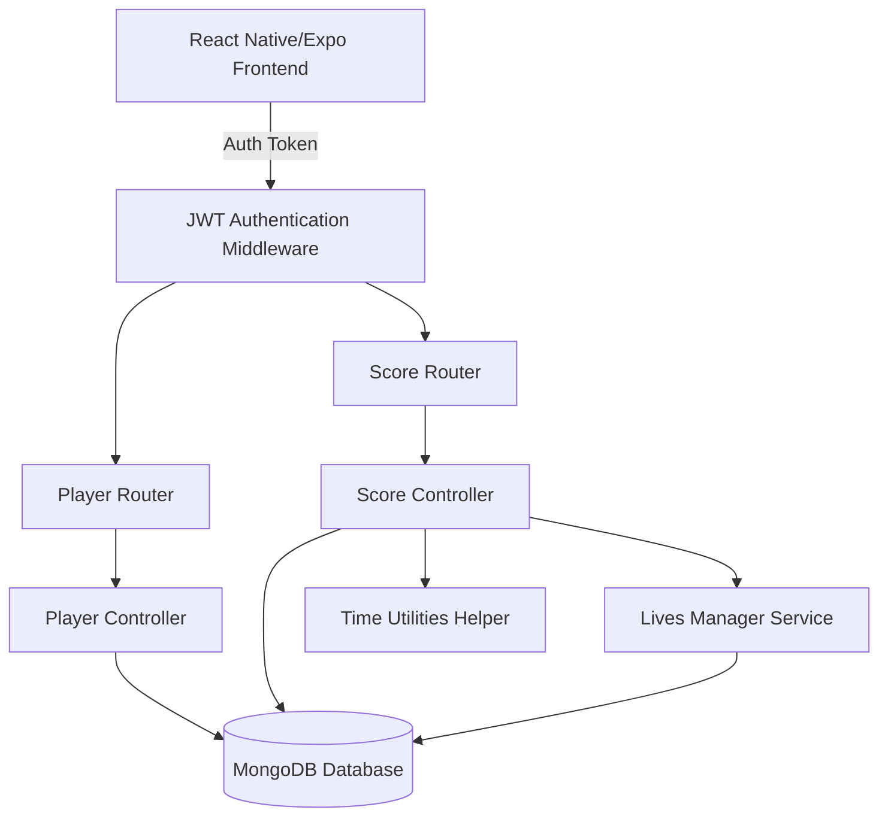

# 3310 Backend Technical Documentation

This document details the architecture, schemas, API specifications, and safety mechanics of the **3310 Game Backend**, built with Node.js, Express, TypeScript, and MongoDB (via Mongoose) in native ESM format.

---

## 1. System Architecture Overview

The backend serves as the single source of truth for the Free Play Launch (Version 1.0) of the retro-arcade Snake game. It manages player accounts (onboarded via ERC-4337 smart wallets), tracks daily and weekly game sessions, calculates leaderboard standings, and hosts an anti-cheat validation pipeline.



---

## 2. Database Models & Schema Specifications

The database contains four core collections.

### 2.1 Player Schema (src/models/Player.ts)
Stores core profiles and referral relationships. Addresses and referral codes are lowercased and indexed for maximum lookup performance.

*   `address` (String, Unique, Required, Lowercase): User's ZeroDev smart account address.
*   `username` (String, Unique, Required): User's custom arcade handle.
*   `email` (String, Lowercase, Optional): User's social authentication email.
*   `referralCode` (String, Unique, Required, Uppercase): Alphanumeric code generated on signup.
*   `referredBy` (String, Lowercase, Nullable): Address of the user who referred this player.
*   `referralPoints` (Number): Referral points used as secondary tiebreakers.
*   `referralCount` (Number): Number of successful referrals.
*   `isSubscribed` (Boolean, Default: false): Phase 2 backward compatibility.
*   `subscriptionExpiresAt` (Date, Nullable): Phase 2 subscription countdown.
*   `lifetimeEarnings` (Number): Phase 2 rewards tally.

### 2.2 Score Schema (src/models/Score.ts)
Maintains individual game results. The score value is stored as a `Number` to support numerical queries and sorting.

*   `playerAddress` (String, Required, Lowercase): Player identifier.
*   `score` (Number, Required): Single-game score.
*   `dayId` (String, Required): Format `YYYY-MM-DD` in UTC.
*   `weekId` (Number, Required): Current week since genesis.
*   `isValid` (Boolean, Default: true): True if anti-cheat checks passed.

### 2.3 GameSession Schema (src/models/GameSession.ts)
Tracks daily limits, accumulated stats, and live telemetry for a single player on a specific day. Configured with a compound index on `{ playerAddress: 1, dayId: 1 }`.

*   `playerAddress` (String, Required, Lowercase).
*   `dayId` (String, Required): Format `YYYY-MM-DD`.
*   `weekNumber` (Number, Required).
*   `gamesPlayedInCurrentHour` (Number): Counts attempts in the active hourly window.
*   `firstGameInHour` (Date, Nullable): Starting timestamp of the current hourly window.
*   `currentLives` (Number, Capacity: 5): Remaining game credits.
*   `nextRefillAt` (Date, Nullable): Countdown timestamp for a full batch refill.
*   `dailyAccumulatedScore` (Number): Total valid scores for the day.
*   `weeklyAccumulatedScore` (Number): Total valid scores for the week.

### 2.4 GameAttempt Schema (src/models/GameAttempt.ts)
Coordinates active game sessions to enable anti-cheat validation. Configured with a TTL index of 7 days to clean up stale records.

*   `gameSessionId` (String, Unique, Required): UUID returned when starting a game.
*   `playerAddress` (String, Required, Lowercase).
*   `startTime` (Date, Required): Timestamp marking the start of gameplay.
*   `isSubmitted` (Boolean): True once the score is finalized.

---

## 3. Core Engine Mechanics

### 3.1 Lives & Refill Engine (src/services/livesManager.ts)
*   **Capacity & Consumption**: Each game start validates that lives are `> 0` and decrements `currentLives` by 1.
*   **Countdown Refill**: When lives drop from 5 to 4, `nextRefillAt` is populated with `Date.now() + 1 hour`. Once that timestamp is crossed, calling `checkAndApplyRefill()` restores lives to 5 and resets `nextRefillAt` to null.
*   **Daily Transition Carryover**: When a player starts their first game on a new day, `checkAndApplyRefill()` constructs a new `GameSession` document but carries over active parameters (current lives, refill timer, and current week's accumulated scores) from the previous day's document, while resetting the daily score tally to 0.

### 3.2 Time Boundary Mechanics (src/utils/timeUtils.ts)
Calculates time boundaries strictly in UTC:
*   `getDayId()` parses a date object and outputs `YYYY-MM-DD`.
*   `getWeekId()` computes the 1-indexed week count elapsed since the configurable `GENESIS_DATE` (e.g. `2026-05-25T00:00:00Z` representing a Monday), aligning weeks with standard Monday-to-Sunday cycles.

### 3.3 Anti-Cheat Pipeline
1.  **Start Request**: The client requests `/api/scores/start`. The server pre-validates lives and hourly counts, saves a `GameAttempt` with a new UUID and timestamp, and returns it.
2.  **Submit Request**: The client requests `/api/scores/validate-score`.
3.  **Replay Protection**: The server looks up the attempt. If `isSubmitted` is already true, it immediately rejects the request.
4.  **Duration Verification**: The server calculates the elapsed time: `elapsed = (now - startTime) / 1000`. It enforces a strict rate limit: `score / elapsed <= 50` points per second.
5.  **Score Logging**: The score is saved in MongoDB. If valid, the score is added to the user's accumulated session scores; if invalid, it is flagged as `isValid = false` and excluded from leaderboards. In both cases, a life is consumed and the hourly limit counter increments.

---

## 4. API Endpoints Reference

All routes (except player signup) require a valid JSON Web Token (JWT) in the `Authorization: Bearer <JWT>` header.

### 4.1 Player Routing (src/routes/playerRoutes.ts)

#### `POST /api/player`
Registers a new player profile or logs in an existing player. Returns the player record and an auth token.
*   **Payload**: `{ address: string, username: string, email?: string, referredBy?: string }`
*   **Referral Rewards**: If referred by a valid code, adds `25` points to the new user and `50` points to the referrer.
*   **Status Codes**: `201 Created` (New player), `200 OK` (Existing login), `400 Bad Request` (Username taken / Missing fields).

#### `GET /api/player/:address`
Returns core profile metadata and historical stats (single-game high score, total games played).
*   **Headers**: `Authorization: Bearer <JWT>`
*   **Status Codes**: `200 OK`, `404 Not Found`.

---

### 4.2 Scores & Gameplay Routing (src/routes/scoreRoutes.ts)

#### `GET /api/scores/game-session/:address?`
Returns the user's session variables (lives, countdowns, current hourly limit status).
*   **Headers**: `Authorization: Bearer <JWT>`
*   **Status Codes**: `200 OK`.

#### `POST /api/scores/start`
Pre-checks session constraints. Generates and returns a UUID `gameSessionId` for anti-cheat validation.
*   **Headers**: `Authorization: Bearer <JWT>`
*   **Status Codes**: `200 OK`, `400 Bad Request` (Out of lives / Hourly limit reached).

#### `POST /api/scores/validate-score`
Validates duration rate, consumes a life, updates stats, and saves the score.
*   **Headers**: `Authorization: Bearer <JWT>`
*   **Payload**: `{ gameSessionId: string, score: number }`
*   **Status Codes**: `200 OK` (Returns `isValid` boolean, updated lives, and scores), `400 Bad Request` (Replay / Expired session).

#### `GET /api/scores/leaderboard/weekly?weekId=N`
Fetches top 100 players for the week, aggregated via MongoDB pipelines using tiebreaker rules:
`Weekly Score (Desc) -> Total Games Played (Asc) -> Referral Points (Desc)`.
*   **Headers**: `Authorization: Bearer <JWT>`
*   **Status Codes**: `200 OK`.

#### `GET /api/scores/leaderboard/all-time`
Fetches top 100 players sorted by their highest single-game score.
*   **Headers**: `Authorization: Bearer <JWT>`
*   **Status Codes**: `200 OK`.

---

## 5. Middleware Details (src/middleware/auth.ts)

Uses standard HS256 JWTs signed with `process.env.JWT_SECRET`. Checks for `Bearer` prefix in header:
```typescript
// Decoded req.user structure:
req.user = {
  address: string // Lowercased smart account address
}
```
If missing or invalid, throws `401 UNAUTHORIZED` or `403 INVALID_TOKEN`.

---

## 6. Self-Contained Testing (src/tests/testBackend.ts)

The backend contains a self-contained integration test suite that spins up a mock express server on port `5001` and hooks to an isolated `mongodb-memory-server` database. It tests:
1.  Registration and referral point allocations.
2.  Duplicate handle constraints.
3.  Game session initialization.
4.  Standard gameplay validation.
5.  Cheat score rejection (points-per-second violations).
6.  Replay attack prevention (re-submitting a session ID).
7.  Hourly rate limits (rejecting the 6th game attempt in an hour).
8.  Tiebreaker-sorted Weekly Leaderboard aggregations.

Run the test suite locally with:
```bash
npx tsx src/tests/testBackend.ts
```
